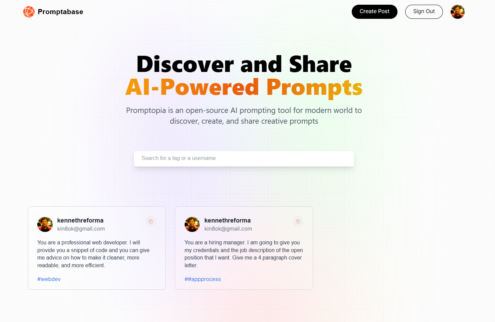

# Promptabase

## Overview

Promptabase is an AI Prompt Storage Platform web application designed to provide users with a convenient and simple way to store, manage, and retrieve AI prompts. Built using technologies such as Next.js, Tailwind CSS, and MongoDB, this platform offers a seamless experience for users looking to interact with AI-generated content.

## Features

### User Authentication and Authorization

The platform offers simplified user-friendly authentication mechanism with Google SSO through the use of Google Cloud and Next-Auth, ensuring that only authorized users can manage their AI prompts. User data is securely stored and managed to guarantee privacy and data integrity.

### Dashboard Overview

Upon logging in, users are greeted with an overview of their stored AI prompts. The dashboard showcases key information, including the prompt content, author information, and relevant tags.

### CRUD Operations

The platform enables users to perform a range of CRUD (Create, Read, Update, Delete) operations on their AI prompts:

1. **Create**: Users can easily create new AI prompts by entering the prompt content and adding tags to help with search.

2. **Read**: Users can view and search for their stored AI prompts through a user-friendly interface. The search functionality allows users to quickly find specific prompts based on keywords or tags.

3. **Update**: Users can edit existing AI prompts, modifying the prompt content or updating associated tags to keep their prompts organized.

4. **Delete**: If a prompt is no longer needed, users can securely delete it from their collection, ensuring a clutter-free prompt management experience.

### Tagging and Categorization

Tags play a pivotal role in keeping AI prompts organized. Users can assign one or more tags to each prompt, making it easy to filter and retrieve prompts related to specific topics or themes.

### Responsive UI with Tailwind CSS

The platform boasts a responsive and aesthetically pleasing user interface, thanks to the integration of Tailwind CSS. Whether accessed from a desktop computer or a mobile device, users will enjoy a consistent and visually appealing experience.

### MongoDB Integration

MongoDB serves as the platform's backend database, providing a scalable and efficient storage solution for AI prompts. The integration with MongoDB ensures that user data is persisted securely and can be accessed quickly.

### Data Validation and Error Handling

To guarantee the integrity of data and a smooth user experience, the platform includes robust data validation and error handling mechanisms. Users receive clear and actionable feedback in case of any input errors or issues.

## Tech Stack

- **Frontend**: Next.js, Tailwind CSS
- **Backend**: Next.js
- **Database**: MongoDB
- **Authentication**: Google Cloud Oauth, Next-Auth
- **Deployment**: Vercel

## version 1.0

## For v1.1 improvements:

- Search implementation
- Click on tag
- View on profiles

> [!NOTE]
> This project was done with walkthrough from **Javascript Mastery** [Next.js 13 Full Course 2023](https://www.youtube.com/watch?v=wm5gMKuwSYk).
